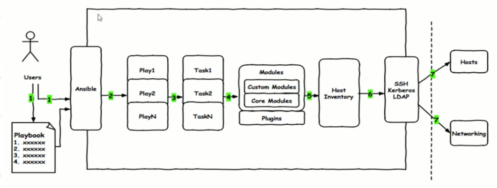

# Ansible

## 常用模块
```
command
ping  用于检测远程主机是否存活
shell 在远程主机上执行shell命令
script 在远端主机执行本地脚本
yum/apt 用于安装软件包
service 用于管理服务
file 用于配置文件属性
copy 复制文件到远程主机
setup 查看远程主机的基本信息
```

## 测试连通性 

```
ansibel all -m ping
```

## 在所有目标机器上执行命令
```
ansible test -a pwd
```

> \# -i     指定 hosts 文件位置 —inventory=PATH 指定库存主机文件的路径,默认为/etc/ansible/hosts.
>
> \# -u username 指定 SSH 连接的用户名
>
> \# -U     —sud-user=SUDO_User sudo到哪个用户，默认为 root
>
> \# -k      指定远程用户密码
>
> \# -K     —ask-sudo-pass 提示密码使用sudo
>
> \# -f     指定并发数 —forks=NUM 并行任务数。NUM被指定为一个整数,默认是5。 #ansible testhosts -a “/sbin/reboot” -f 10 重启testhosts组的所有机器，每次重启10台
>
> \# -s     如需要 root 权限执行时使用 ( 连接用户不是 root 时 )
>
> \# -K     -s 时，-K 输入 root 密码
>
> \# -a     模块参数
>
> \# -m     执行的模块 ，默认使用 command 模块，所以如果是只执行单一命令可以不用 -m参数


# Playbook



## 执行命令

```
ansible-playbook -i hosts -u root test.sh
```

## 部署命令

```
ansible-playbook -i hosts deploy-env.yml -uroot -k
```

如果安装某个阶段失败，可针对性测试.

例如：只运行部署插件

```
ansible-playbook -i hosts single-master-deploy.yml -uroot -k --tags addons
```

```
 -u REMOTE_USER, --user=REMOTE_USER  
＃ ssh 连接的用户名
 -k, --ask-pass    
＃ssh登录认证密码
 -s, --sudo           
＃sudo 到root用户，相当于Linux系统下的sudo命令
 -U SUDO_USER, --sudo-user=SUDO_USER    
＃sudo 到对应的用户
 -K, --ask-sudo-pass     
＃用户的密码（—sudo时使用）
 -T TIMEOUT, --timeout=TIMEOUT 
＃ ssh 连接超时，默认 10 秒
 -C, --check      
＃ 指定该参数后，执行 playbook 文件不会真正去执行，而是模拟执行一遍，然后输出本次执行会对远程主机造成的修改

 -e EXTRA_VARS, --extra-vars=EXTRA_VARS    
＃ 设置额外的变量如：key=value 形式 或者 YAML or JSON，以空格分隔变量，或用多个-e
 -f FORKS, --forks=FORKS    
＃ 进程并发处理，默认 5
 -i INVENTORY, --inventory-file=INVENTORY   
＃ 指定 hosts 文件路径，默认 default=/etc/ansible/hosts
 -l SUBSET, --limit=SUBSET    
＃ 指定一个 pattern，对- hosts:匹配到的主机再过滤一次
 --list-hosts  
＃ 只打印有哪些主机会执行这个 playbook 文件，不是实际执行该 playbook
 --list-tasks   
＃ 列出该 playbook 中会被执行的 task
 --private-key=PRIVATE_KEY_FILE   
＃ 私钥路径
 --step    
＃ 同一时间只执行一个 task，每个 task 执行前都会提示确认一遍
 --syntax-check  
＃ 只检测 playbook 文件语法是否有问题，不会执行该 playbook 
 -t TAGS, --tags=TAGS   
＃当 play 和 task 的 tag 为该参数指定的值时才执行，多个 tag 以逗号分隔
 --skip-tags=SKIP_TAGS   
＃ 当 play 和 task 的 tag 不匹配该参数指定的值时，才执行
 -v, --verbose   
＃输出更详细的执行过程信息，-vvv可得到所有执行过程信息。
```

# Q&A

### 如何忽略错误使 Task 继续执行下去

```
ignore_errors: true
```

### 如何根据一个 task 的执行结果来决定是否执行其它 task

使用 `register` 来监听当前任务的执行情况，使用 `when` 设定条件

### 为什么使用 git，file 等模块比直接执行 shell 要好些

git，file 能够更好地满足幂等性


# 引用资料

http://github.com/shfshanyue/ansible-op

https://www.cnblogs.com/kevingrace/

