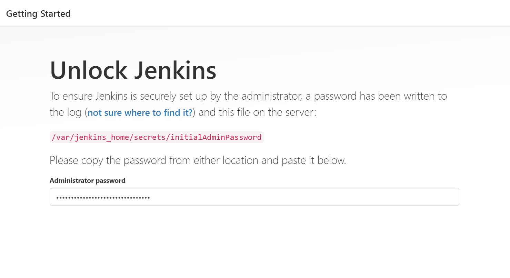
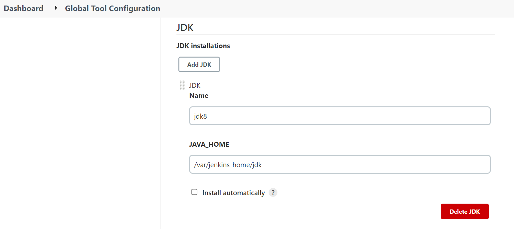
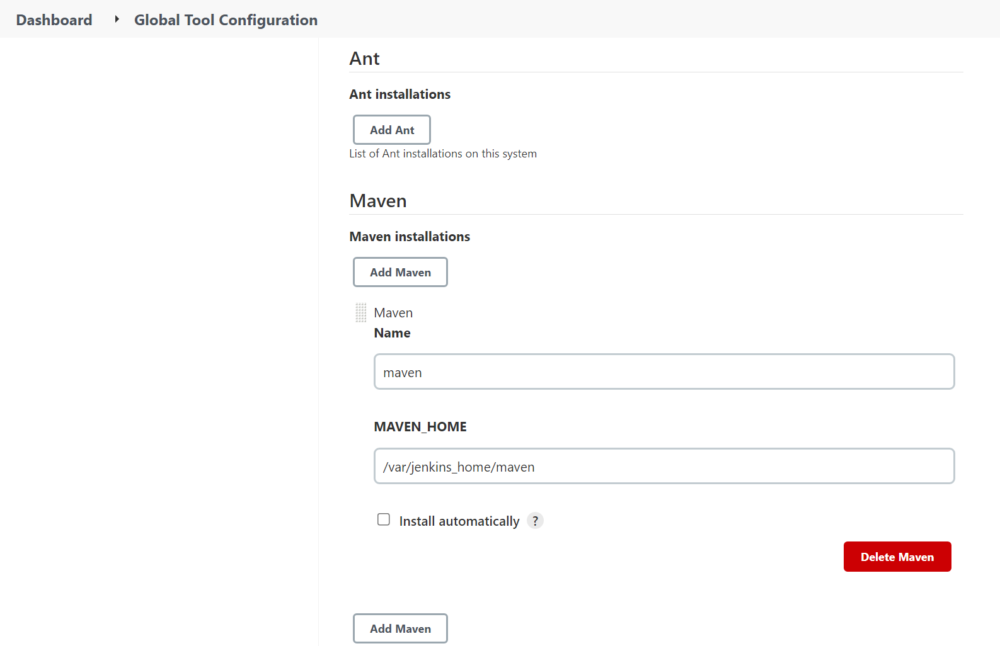

# Jenkins

下载Jenkins的docker镜像

```shell
docker pull jenkins/jenkins:latest
```

为Jenkins建立挂载目录并未目录授权，我这里的目录为 /docker/data/jenkins/

```shell
mkdir -p /docker/data/jenkins/
chown -R 1000:1000 /docker/data/jenkins/
```


docker-compose.yml

```yml
version: "3.1"
services:
  jenkins:
    image: jenkins/jenkins:latest
    container_name: jenkins
    restart: always
    ports:
      - '8080:8080'
      - '50000:50000'
      
    volumes:
      - '/docker/data/jenkins/:/var/jenkins_home'
```

`/var/jenkins_home`  jenkins 家目录




```shell
docker exec jenkins cat /var/jenkins_home/secrets/initialAdminPassword
```


后面就是默认操作下载插件即可


插件

```
Git Parameter
Publish Over SSH
```


把jdk 和maven 放到容器里面

```shell
[root@pipeline-server jenkins]# cp -a /usr/local/jdk/ ./
[root@pipeline-server jenkins]# cp -a /usr/local/maven/ ./
[root@pipeline-server jenkins]# pwd
/docker/data/jenkins
[root@pipeline-server jenkins]# ls
config.xml                      identity.key.enc                             jenkins.model.JenkinsLocationConfiguration.xml  nodeMonitors.xml  secret.key                userContent
copy_reference_file.log         jdk                                          jenkins.telemetry.Correlator.xml                nodes             secret.key.not-so-secret  users
hudson.model.UpdateCenter.xml   jenkins.install.InstallUtil.lastExecVersion  jobs                                            plugins           secrets                   war
hudson.plugins.git.GitTool.xml  jenkins.install.UpgradeWizard.state          maven                                           queue.xml.bak     updates                   workflow-libs
[root@pipeline-server jenkins]#

```

## 配置jdk

 


## 配置maven




## Jenkins 插件源


```
https://mirrors.tuna.tsinghua.edu.cn/jenkins/updates/update-center.json
```


