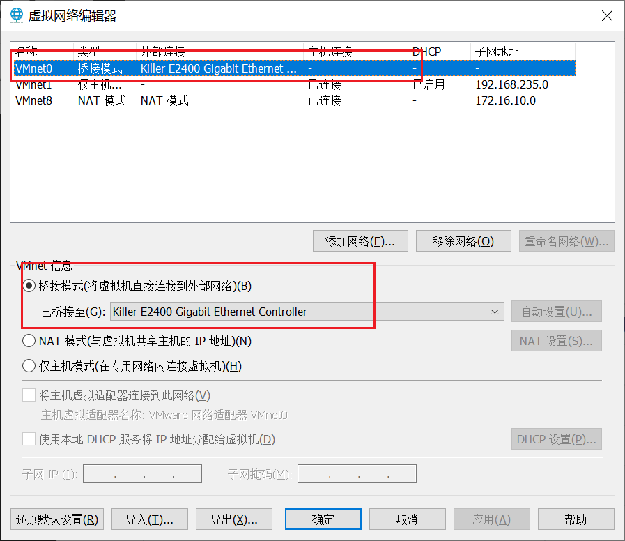

# 单网卡配置

配置


1. 更改适配器设置
2. 选择VMware Virtual Ethernet Adapter for VMnet8，并双击打开
3. 点击属性
4. 双击TCP/IP4
5. 设置固定IP和子网掩码


# 双网卡配置

## 网络规划

我们采用的是VMware制作的虚机， 为了保证虚机可以上网，同时也在一个封闭的
内网中，采取双网卡的方式。

* 桥接网络负责虚机与外网互通

* NAT网络负责虚机互通，虚机与宿主机互通

## VMware 修改虚拟网络



## 网卡1配置ifcfg-ens32

采用桥接模式，与宿主机同网络（就是你物理机的所处的内网），建议 IP 自动获取，你只是用此网卡来访问外网， IP 不需要固定。


## 网卡2配置ifcfg-ens33

选择“NAT模式“的连接方式，可以自动从上面设置的172.16.10.0 网段获取到 IP，也可以指定此网段的固定 IP。


## 网卡配置文件修改

如果没有，则新建这个文件，文件内容如下

```shell
vi /etc/sysconfig/network-scripts/ifcfg-ens32
```

```shell
TYPE=Ethernet
PROXY_METHOD=none
BROWSER_ONLY=no
BOOTPROTO=dhcp
DEFROUTE=yes
IPV4_FAILURE_FATAL=no
NAME=ens32
DEVICE=ens32
ONBOOT=yes
```

```shell
vi /etc/sysconfig/network-scripts/ifcfg-ens33
```

```shell
TYPE=Ethernet
BOOTPROTO=static 
DEFROUTE=yes
PEERDNS=yes
PEERROUTES=yes
IPV4_FAILURE_FATAL=no
NAME=ens33
DEVICE=ens33
ONBOOT=yes
IPADDR=172.16.10.110
NETMASK=255.255.255.0
GATEWAY=172.16.10.2
```

## DNS配置文件

```shell
vi /etc/resolv.conf
```

```shell
nameserver 114.114.114
```

## 重启网络

```shell
systemctl restart network
```

## 测试验证


```shell
[root@localhost ~]#
[root@localhost ~]# ip a
1: lo: <LOOPBACK,UP,LOWER_UP> mtu 65536 qdisc noqueue state UNKNOWN group default qlen 1000
    link/loopback 00:00:00:00:00:00 brd 00:00:00:00:00:00
    inet 127.0.0.1/8 scope host lo
       valid_lft forever preferred_lft forever
    inet6 ::1/128 scope host
       valid_lft forever preferred_lft forever
2: ens32: <BROADCAST,MULTICAST,UP,LOWER_UP> mtu 1500 qdisc pfifo_fast state UP group default qlen 1000
    link/ether 00:0c:29:b1:db:70 brd ff:ff:ff:ff:ff:ff
    inet 192.168.0.106/24 brd 192.168.0.255 scope global noprefixroute dynamic ens32
       valid_lft 6234sec preferred_lft 6234sec
    inet6 fe80::20c:29ff:feb1:db70/64 scope link
       valid_lft forever preferred_lft forever
3: ens33: <BROADCAST,MULTICAST,UP,LOWER_UP> mtu 1500 qdisc pfifo_fast state UP group default qlen 1000
    link/ether 00:0c:29:b1:db:7a brd ff:ff:ff:ff:ff:ff
    inet 172.16.10.110/24 brd 172.16.10.255 scope global noprefixroute ens33
       valid_lft forever preferred_lft forever
    inet6 fe80::20c:29ff:feb1:db7a/64 scope link
       valid_lft forever preferred_lft forever
[root@localhost ~]# ping baidu.com -c 3
PING baidu.com (39.156.66.10) 56(84) bytes of data.
64 bytes from 39.156.66.10 (39.156.66.10): icmp_seq=1 ttl=49 time=15.6 ms
64 bytes from 39.156.66.10 (39.156.66.10): icmp_seq=2 ttl=49 time=16.2 ms
64 bytes from 39.156.66.10 (39.156.66.10): icmp_seq=3 ttl=49 time=15.9 ms

--- baidu.com ping statistics ---
3 packets transmitted, 3 received, 0% packet loss, time 2004ms
rtt min/avg/max/mdev = 15.660/15.965/16.257/0.284 ms
[root@localhost ~]# ping 172.16.10.70 -c 3
PING 172.16.10.70 (172.16.10.70) 56(84) bytes of data.
64 bytes from 172.16.10.70: icmp_seq=1 ttl=64 time=0.556 ms
64 bytes from 172.16.10.70: icmp_seq=2 ttl=64 time=0.520 ms
64 bytes from 172.16.10.70: icmp_seq=3 ttl=64 time=1.94 ms

--- 172.16.10.70 ping statistics ---
3 packets transmitted, 3 received, 0% packet loss, time 2002ms
rtt min/avg/max/mdev = 0.520/1.005/1.940/0.661 ms

```

