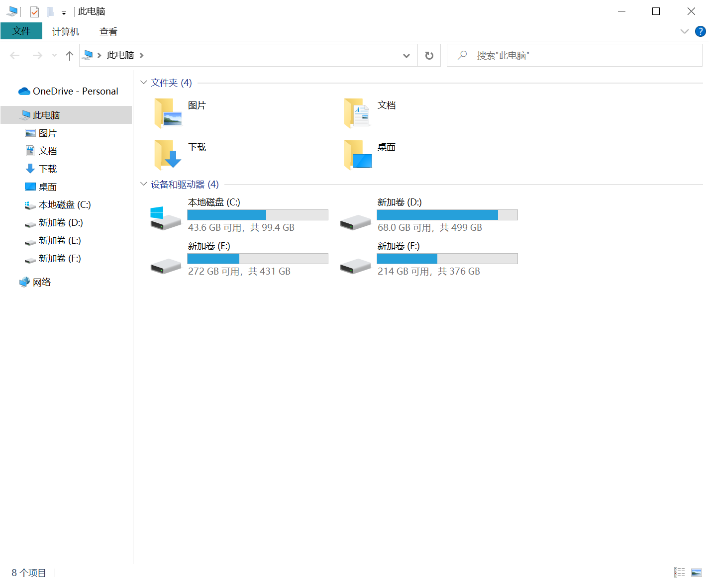
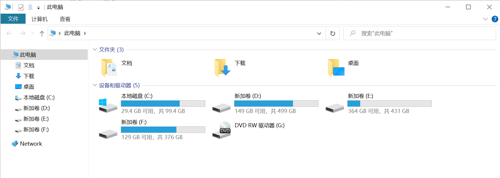
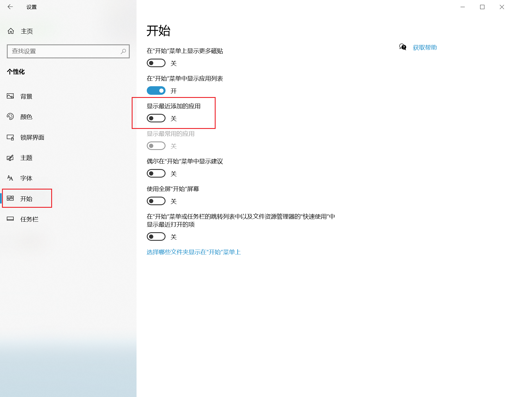

## 删除我的电脑左侧栏信息

### 去掉quick access
```
"HKEY_LOCAL_MACHINE\SOFTWARE\Microsoft\Windows\CurrentVersion\Explorer"增加DWORD的key-value: "HubMode=1".
```
### 取消文件资源管理器左侧 下载文件夹
```
[-HKEY_LOCAL_MACHINE\SOFTWARE\Microsoft\Windows\CurrentVersion\Explorer\MyComputer\NameSpace{088e3905-0323-4b02-9826-5d99428e115f}]
```
### 取消文件资源管理器左侧 3D对象文件夹
```
[-HKEY_LOCAL_MACHINE\SOFTWARE\Microsoft\Windows\CurrentVersion\Explorer\MyComputer\NameSpace{0DB7E03F-FC29-4DC6-9020-FF41B59E513A}]
```
### 取消文件资源管理器左侧 图片文件夹
```
[-HKEY_LOCAL_MACHINE\SOFTWARE\Microsoft\Windows\CurrentVersion\Explorer\MyComputer\NameSpace{24ad3ad4-a569-4530-98e1-ab02f9417aa8}]
```
### 取消文件资源管理器左侧 音乐文件夹
```
[-HKEY_LOCAL_MACHINE\SOFTWARE\Microsoft\Windows\CurrentVersion\Explorer\MyComputer\NameSpace{3dfdf296-dbec-4fb4-81d1-6a3438bcf4de}]
```
### 取消文件资源管理器左侧 桌面文件夹
```
[-HKEY_LOCAL_MACHINE\SOFTWARE\Microsoft\Windows\CurrentVersion\Explorer\MyComputer\NameSpace{B4BFCC3A-DB2C-424C-B029-7FE99A87C641}]
```
### 取消文件资源管理器左侧 文档文件夹
```
[-HKEY_LOCAL_MACHINE\SOFTWARE\Microsoft\Windows\CurrentVersion\Explorer\MyComputer\NameSpace{d3162b92-9365-467a-956b-92703aca08af}]
```
### 取消文件资源管理器左侧 视频文件夹
```
[-HKEY_LOCAL_MACHINE\SOFTWARE\Microsoft\Windows\CurrentVersion\Explorer\MyComputer\NameSpace{f86fa3ab-70d2-4fc7-9c99-fcbf05467f3a}]
```
删除后，重启Windows资源管理器
效果如下，非常简洁




### 关闭开始栏显示最近添加



### 移除小娜

```
get-appxpackage #查看安装服务
Get-AppxPackage *WindowsStore* | Remove-AppxPackage     #应用商店
get-appxpackage *Microsoft.People* | remove-appxpackage  #人脉
get-appxpackage Microsoft.Wallet |remove-appxpackage
get-appxpackage Microsoft.WindowsCamera |remove-appxpackage
Get-AppxPackage -allusers Microsoft.549981C3F5F10 | Remove-AppxPackage
## XboxApp
Get-AppxPackage -allusers |findstr  Microsoft.XboxApp
Remove-AppPackage Microsoft.XboxApp_48.49.31001.0_x64__8wekyb3d8bbwe
```

## cmd 下查询安装命令路径
```
C:\> where aws    #默认
C:\> where /R c:\ aws  #指定盘符搜索
```
## 查看服务端口
```
netstat -ano |findstr 8080
```
## 查看服务是否启动
```
net start http
```
## 通过注册表查找安装的软件
通过此目录下可以删除一些无法删除干净的软件
如果某个软件绑定mac地址了，可以通过此地方进行删除
```
计算机\HKEY_LOCAL_MACHINE\SOFTWARE
```
## 参考链接
https://docs.microsoft.com/zh-cn/previous-versions/windows/

使用组合键“Win+R”调用运行命令框，键入命令services.msc，回车，
或者，单击“开始”——>“搜索”中输入“服务”——>双击“服务”，回车；